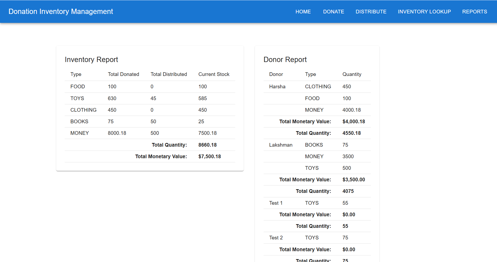

# Donation & Distribution Inventory System

## 1. Problem Statement

organizations often struggle to track donations and prevent distributions. This tool solves that by managing donations, validating distributions, and generating reports to maintain visibility over resources.

---

## 2. What This Project Does

- Record donations (money, food, clothing, etc.)
- Record distributions with inventory validation
- Show inventory levels per donation type
- Show contribution summaries per donor
- Expose REST APIs for all operations
- Includes frontend forms and reports

---

## 3. Technologies

- **Backend:** Java 17, Spring Boot, PostgreSQL, JPA
- **Frontend:** React, Material UI, Axios
- **Testing Framework:** Mockito, Junit 5 Assertions
- **API Testing Tool & Setup:** Postman,Maven

---

## 4. How to Run

### Backend (Spring Boot)
1. Clone the repository:
```bash
git clone https://github.com/harsha-reddy123/shelter-donation-inventory-management.git
cd DonorInventoryTool
```
2. Create PostgreSQL database:
```bash
CREATE DATABASE shelter_donation_db;
```
3. Update database credentials in application.properties:
```bash
spring.datasource.url=jdbc:postgresql://localhost:5432/shelter_donation_db
spring.datasource.username=postgres #username,password differs for your local
spring.datasource.password=postgres
```
4. Build and run:
```bash
mvn clean install
mvn spring-boot:run
```

5. Backend runs on:
```arduino
http://localhost:8080
```
---
Frontend Setup

1. Navigate to frontend folder:
```bash
cd frontend
```

2. Install dependencies:
```bash
npm install
```

3. Start the app:
```bash
npm start
```
Frontend runs on:
```arduino
http://localhost:3000
```
5. API Endpoints
All REST APIs are documented. Import the provided Postman collection from the repo


6. Reports Included

   1. Inventory Report: shows total donated, distributed, and stock per type

    2. Donor Report: shows contributions per donor, monetary + total quantity


7. Notes

   1. Distribution is rejected if stock is insufficient 
   2. Exception handling and validation are built-in Data can be viewed or managed through Postman or the frontend
   3. Data can be viewed or managed through Postman or the frontend


8. Application Screenshot

